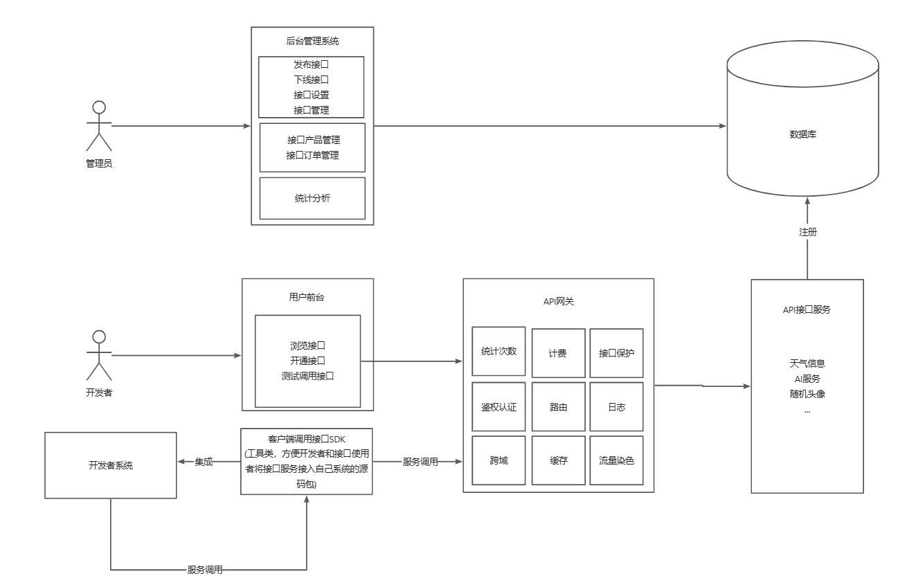

# xiapi开放平台

## 架构图

## 各模块
1. xiapi-backend

   对接口服务进行管理

   https://gitee.com/realrx/xiapi-backend

2. xiapi-gateway

   网关服务，对接口服务进行保护

   https://gitee.com/realrx/xiapi-gateway

3. xiapi-interface

   接口服务，提供第三方服务

   https://gitee.com/realrx/xiapi-interface

4. xiapi-common

   系列项目公共类模块

   https://gitee.com/realrx/xiapi-common

5. xiapi-client-sdk

   给用户程序轻松调用接口服务的SDK包

   https://gitee.com/realrx/xiapi-client-sdk

6. xiapi-frontend

   xiapi项目前端

   https://gitee.com/realrx/xiapi-frontend

## 本地调试
1. clone上面六个项目
2. maven install xiapi-common 与 xiapi-client-sdk
3. 运行 xiapi-backend 项目里的sql文件，建库建表
4. 修改 xiapi-backend 项目里yml文件里的配置，将数据库，nacos，mq等服务改为自己创建服务的地址，用户名与密码
5. 刷新 xiapi-backend 与 xiapi-gateway 的pom.xml,确保已引入common与sdk依赖
6. 先启动该项目所需的第三方服务，mq nacos等
7. 启动xiapi-backend，再启动xiapi-gateway，最后启动xiapi-interface
8. 启动xiapi-frontend